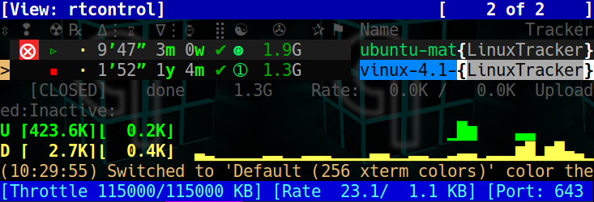
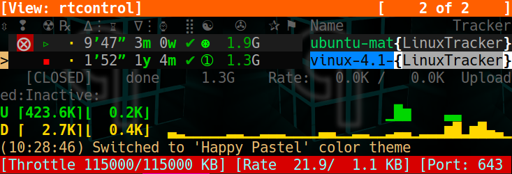
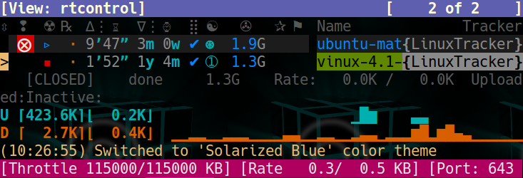
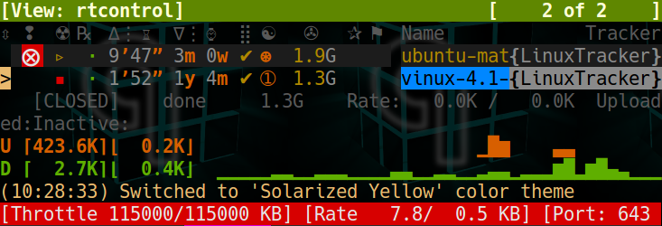
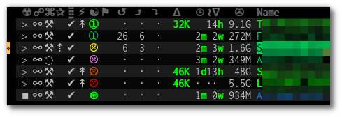
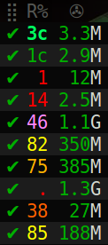
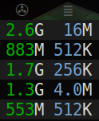

Advanced Customization
======================

This chapter helps you to personalize your `rTorrent` experience,
specifically regarding the `ncurses` terminal user interface.
It provides some background on the standard configuration,
and how you can tweak it further according to your preferences.

.. _color-schemes:

Color Scheme Configuration
--------------------------

This section describes how you can change all the colors in `rTorrent-PS` to your liking.
Note that there are `existing color schemes`_ provided by the `pyrocore` configuration,
and you can rotate through them using the ``~`` key thanks to `rtorrent.d/theming.rc`_.

You can copy one of the provided color scheme ``*.rc.default`` files in ``~/.pyroscope/color-schemes/``
to a new ``‹mytheme›.rc`` file.
Details about how to specify colors and so on are in the sub-sections that follow.

.. contents:: Color Configuration Details
   :local:

And here are some visuals of the default schemes…

|color-scheme-default|   |color-scheme-happy-pastel|

|color-scheme-solarized-blue|   |color-scheme-solarized-yellow|

.. _`existing color schemes`: https://github.com/pyroscope/pyrocore/tree/master/src/pyrocore/data/config/color-schemes
.. _`rtorrent.d/theming.rc`: https://github.com/pyroscope/pyrocore/blob/master/src/pyrocore/data/config/rtorrent.d/theming.rc#L1

Working With Color Schemes
^^^^^^^^^^^^^^^^^^^^^^^^^^

If your terminal works as intended,
you now might want to find you own color theme.
The easiest way is to use a second shell and :ref:`rtxmlrpc`. Try
out some colors, and add the combinations you like to your
``~/.rtorrent.rc``.

.. code-block:: shell

    # For people liking candy stores...
    rtxmlrpc ui.color.title.set "bold magenta on bright cyan"

You can use the following code in a terminal to dump a full color scheme from the running client:

.. code-block:: shell

    for i in $(rtxmlrpc system.listMethods | egrep '^ui.color.[^.]+$'); do
        echo $i = $(rtxmlrpc -r $i | tr "'" '"') ;
    done

Adding Your Own Color Schemes
^^^^^^^^^^^^^^^^^^^^^^^^^^^^^

Color schemes are lists of ``ui.color.‹color name›.set`` commands in your configuration,
or in a  ``*.rc[.default]`` file in the ``~/.pyroscope/color-schemes/`` directory.
If you want to use scheme rotation at all (via the ``~`` key),
put your own schemes into extra ``color-schemes/*.rc`` files and not the main configuration.

The set of color names is predetermined and refers to the *meaning* of the color,
i.e. where it is used on the canvas. ``footer`` and ``alarm`` are obvious examples.

Here's a configuration example showing all the commands and their defaults:

.. code-block:: ini

    # UI/VIEW: Colors
    ui.color.alarm.set="bold white on red"
    ui.color.complete.set="bright green"
    ui.color.even.set=""
    ui.color.focus.set="reverse"
    ui.color.footer.set="bold bright cyan on blue"
    ui.color.incomplete.set="yellow"
    ui.color.info.set="white"
    ui.color.label.set="gray"
    ui.color.leeching.set="bold bright yellow"
    ui.color.odd.set=""
    ui.color.progress0.set="red"
    ui.color.progress20.set="bold bright red"
    ui.color.progress40.set="bold bright magenta"
    ui.color.progress60.set="yellow"
    ui.color.progress80.set="bold bright yellow"
    ui.color.progress100.set="green"
    ui.color.progress120.set="bold bright green"
    ui.color.queued.set="magenta"
    ui.color.seeding.set="bold bright green"
    ui.color.stopped.set="blue"
    ui.color.title.set="bold bright white on blue"

See the `ui.color.* command reference`_ for details on these and related commands.

The following color settings work better than the default ones in a 256
color terminal (gnome-terminal), for me at least. Your mileage (color
table) may vary. Having 256 colors means you have very dark shades of
grey, and that is used here to set the even / odd backgrounds.

.. code-block:: ini

    ui.color.complete.set=41
    ui.color.stopped.set=33

    ui.color.footer.set="bright cyan on 20"
    ui.color.even.set="on 234"
    ui.color.odd.set="on 232"

    ui.color.progress0.set=196
    ui.color.progress20.set=202
    ui.color.progress40.set=213
    ui.color.progress60.set=214
    ui.color.progress80.set=226
    ui.color.progress100.set=41
    ui.color.progress120.set="bold bright green"

|rt-ps-glyphs|

Note that you might need to enable support for 256 colors in your
terminal, see :ref:`canvas-256-colors` for a description. In a nutshell, you need to
install the ``ncurses-term`` package if you don't have it already, and
also add these commands to your `rTorrent` start script:

.. code-block:: shell

    if [ "$TERM" = "${TERM%-256color}" ]; then
        export TERM="$TERM-256color"
    fi

.. _`ui.color.* command reference`: https://rtorrent-docs.readthedocs.io/en/latest/cmd-ref.html#term-ui-color-custom1-9

.. _custom-layout:

Customizing the Display Layout
------------------------------

.. contents:: Canvas v2 Topics
   :local:

Canvas v2 Overview
^^^^^^^^^^^^^^^^^^

The main display with the downloads list is flexible and
can be configured to your will, in `rTorrent-PS 1.1` and up.
This is also known as *canvas v2*.

Use the following :ref:`rtxmlrpc` command to check if you have a version
that can do this:

.. code-block:: shell

    $ rtxmlrpc "system.has=,canvas_v2"
    1
    # The '1' means you have canvas v2 on board;
    # a '0' or "Method 'system.has' not defined" means you don't.

The only fixed parts are the position indicator at the very left of the display,
and the combined name / tracker column on the right.
The latter takes all the space left by other columns.

Inspecting Your Display
^^^^^^^^^^^^^^^^^^^^^^^

To list the columns you have in your setup, call :ref:`rtxmlrpc` like so:

.. code-block:: console

    $ rtxmlrpc method.get=,ui.column.render | sed -re 's/ /␣/g' | sort
    100:3C95/2:❢␣␣
    110:2C92/2:☢␣
    120:?2:☍␣
    130:?2:⌘␣
    400:?3C23/3:␣↺␣
    410:?3C24/3:␣⤴␣
    420:?3C14/3:␣⤵␣
    500:?2:⚡␣
    510:3C28/3:℞␣␣
    520:6C96/6:∆⋮␣⌛␣␣
    530:6C90/6:∇⋮␣⌚␣␣
    800:3:⋉␣
    900:?5C24/3C21/2:␣Σ⇈␣␣
    910:2C94/2:⣿␣
    920:3C93/3:☯␣␣
    930:5C15/3C21/2:␣✇␣␣␣
    970:2C91/2:✰␣
    980:2C16/2:⚑␣

The important thing here are the numbers in front,
which define the sort order of columns from left to right.
They also allow to address a specific column,
which becomes important in a moment.

All these are built-in defaults, except the throttle indicator ``⋉`` with index 800,
which is defined in `~/rtorrent/rtorrent.d/05-rt-ps-columns-v2.rc.include`_ of `pimp-my-box`_.

.. important::

    You **MUST** update your `pimp-my-box`_ configuration
    if you used that to set up your system.
    Otherwise you'll get duplicate columns.

To show the full column definitions with their code, call :ref:`cli-usage-pyroadmin`:

.. code-block:: console

    $ pyroadmin --dump-rc | grep -A1 ui.column.render | egrep '^(method.set_key|    )'
    method.set_key = ui.column.render, "100:3C95/2:❢  ", \
        ((array.at, {"  ", "♺ ", "⚠ ", "◔ ", "⚡ ", "↯ ", "¿?", "⨂ "}, ((d.message.alert)) ))
    method.set_key = ui.column.render, "110:2C92/2:☢ ", \
        ((string.map, ((cat, ((d.is_open)), ((d.is_active)) )), {00, "▪ "}, …, {11, "▹ "}))
    …
    method.set_key = ui.column.render, "980:2C16/2:⚑ ", \
        ((array.at, {"  ", "⚑ "}, ((d.views.has, tagged)) ))

.. _pimp-my-box: https://github.com/pyroscope/pimp-my-box

Column Layout Definitions
^^^^^^^^^^^^^^^^^^^^^^^^^

The keys of the ``ui.column.render`` multi-command must follow a defined format,
namely ``‹index›:〈?〉‹width›〈‹color definition›〉:‹title›``.
There are three fields, separated by colons.
The parts in ``〈…〉`` are optional.

``‹index›`` was already mentioned, used for sorting and addressing columns.

The second field can start with a ``?`` to tag this column as ‘sacrificial’,
i.e. optional in the face of too narrow terminals.
``‹width›`` is a column's width in characters.
The ``‹color definition›`` determines what terminal attributes are used to render these characters,
and is a sequence of ``C‹color index›/‹length›`` elements.

Finally, ``‹title›`` is used for the column's heading.
Make sure to end it with a space to leave room for wide Unicode glyphs,
and always make it as long as the column width.

To get a color index table, try this command:

.. code-block:: shell

    rtxmlrpc system.has.private_methods \
        | egrep '^ui.color.*index$' \
        | xargs -I+ rtxmlrpc -i 'print="+ = ",(+)'

Since the ``ui.color.*index`` commands are private, the output must go to the `rTorrent` console.
This is what you'll see (timestamps removed):

.. code-block:: ini

    ui.color.alarm.index = 22
    ui.color.complete.index = 23
    ui.color.custom1.index = 1
    ui.color.custom2.index = 2
    ui.color.custom3.index = 3
    ui.color.custom4.index = 4
    ui.color.custom5.index = 5
    ui.color.custom6.index = 6
    ui.color.custom7.index = 7
    ui.color.custom8.index = 8
    ui.color.custom9.index = 9
    ui.color.even.index = 30
    ui.color.focus.index = 19
    ui.color.footer.index = 18
    ui.color.incomplete.index = 27
    ui.color.info.index = 21
    ui.color.label.index = 20
    ui.color.leeching.index = 28
    ui.color.odd.index = 29
    ui.color.progress0.index = 10
    ui.color.progress20.index = 11
    ui.color.progress40.index = 12
    ui.color.progress60.index = 13
    ui.color.progress80.index = 14
    ui.color.progress100.index = 15
    ui.color.progress120.index = 16
    ui.color.queued.index = 26
    ui.color.seeding.index = 24
    ui.color.stopped.index = 25
    ui.color.title.index = 17

There are also columns with *dynamic* color schemes, using a color index ≥ 90,
which map to a ‘normal’ color index depending on an item's attributes.
An example is ``3C95/2`` for the alert column,
which changes to red (``ui.color.alarm``) if there is an active alert.

This is a list of the dynamic color schemes:

    * 90: ``DOWN_TIME`` – Download (∇ *leeching*) or time display (⌚ *info* + *seeding*/*incomplete*)
    * 91: ``PRIO`` – A color for ✰, depending on ``d.priority``: *progress0*, *progress60*, *info*, *progress120*
    * 92: ``STATE`` – A color for ☢, depending on ``d.is_open`` (*progress0* if not) and ``d.is_active`` (*progress80* or *progress100*)
    * 93: ``RATIO`` – A *progress* color for ☯ from 0 to 120
    * 94: ``PROGRESS`` – A *progress* color from 0 to 100 for the ⣿ column
    * 95: ``ALERT`` – For ❢, *info* or *alarm* depending on alert state
    * 96: ``UP_TIME`` – Upload (∆ *seeding*) or time display (⌛ *info* + *seeding*/*incomplete*)

The mixed ``DOWN_TIME`` and ``UP_TIME`` schemes must span the full width of the column,
and can only be used with *one* color definition in the column key (anything after them is ignored).

.. _add-custom-columns:

Defining Your Own Columns
^^^^^^^^^^^^^^^^^^^^^^^^^

This example shows how to replace the ratio column (920)
with a pure ASCII version. You can see the result on the right.

Place this code in your custom configuration,
e.g. in the ``_rtlocal.rc`` file (when using `pimp-my-box`_).

.. code-block:: ini

    # Remove the default column
    method.set_key = ui.column.render, (ui.column.spec, 920)

    # Add ASCII ratio in percent
    # (1..99 for incomplete; 1c = 1.0; 1m = 10.0; …)
    method.set_key = ui.column.render, "922:3C93/3:R% ", \
        ((string.replace, ((convert.magnitude, ((math.div, ((d.ratio)), 10)) )), \
                          {"⋅", "."} ))

To construct a column definition like this,
you need to understand `rTorrent Scripting`_ first
– more so than what's sufficient for writing simple configurations.

Looking at the original column definition often helps, e.g. to grab a few snippets for your own version:

.. code-block:: ini

    $ pyroadmin --dump-rc | egrep -A1 '"920:.+"'
    method.set_key = ui.column.render, "920:3C93/3:☯  ", \
        ((string.substr, "☹ ➀ ➁ ➂ ➃ ➄ ➅ ➆ ➇ ➈ ➉ ", \
                         ((math.mul, 2, ((math.div, ((d.ratio)), 1000)) )), 2, "⊛ "))

Also, try to understand how all the other column definitions work,
you can learn a few tricks that are typical for column rendering.

Especially if you want to display additional values in the same format as an existing column,
you just have to swap the command accessing the displayed item's data.
Here's a chunk size column, all you need to do is
replace ``d.size_bytes`` in the code of column 930 with ``d.chunk_size``,
and give it a new index and heading.

.. code-block:: ini

    ui.color.custom9.set = "bright blue"
    method.set_key = ui.column.render, "935:5C9/3C21/2: ≣   ", \
        ((convert.human_size, ((d.chunk_size)) ))

That example also shows how to use a custom color.

Disabling Columns
^^^^^^^^^^^^^^^^^

The ``ui.column.show`` and ``ui.column.hide`` commands provide the means to
easily change the visibility of columns, without touching their definition.
They both take a list of column keys as their arguments, as either strings or values.

The following example shows column ♯42 only on the *active* and *leeching* views,

.. code-block:: ini

    method.set_key = event.view.show, ~column_42_toggle, \
        "branch = \"string.contains=$ui.current_view=, active, leeching\", \
            ui.column.show=42, ui.column.hide=42"
    ui.column.hide = 42

The ``ui.column.is_hidden`` and ``ui.column.hidden.list`` commands can be used to query the visibility of columns,
the first one takes a single column key as its argument.

.. code-block:: console

    $ rtxmlrpc --repr ui.column.is_hidden '' 42
    1
    $ rtxmlrpc --repr ui.column.hidden.list
    [42]

A practical use of ``ui.column.is_hidden`` is to toggle a column.
This code does so for ♯935, and binds the toggle to the ``_`` key.

.. code-block:: ini

    method.insert = pmb._toggle_chunk_size, simple|private, \
        "branch = ui.column.is_hidden=935, ui.column.show=935, ui.column.hide=935 ; \
         ui.current_view.set = (ui.current_view)"
    pyro.bind_key = toggle_chunk_size, _, "pmb._toggle_chunk_size="

The ``ui.current_view.set = (ui.current_view)`` part forces a redraw of the canvas,
giving you instant feedback.

Adding Traffic Graphs
^^^^^^^^^^^^^^^^^^^^^

Add these lines to your configuration:

.. code-block:: ini

    # Show traffic of the last hour
    network.history.depth.set = 112
    schedule = network_history_sampling,1,32, network.history.sample=
    method.insert = network.history.auto_scale.toggle, simple|private, \
        "branch=network.history.auto_scale=, \
            \"network.history.auto_scale.set=0\", \
            \"network.history.auto_scale.set=1\""
    method.insert = network.history.auto_scale.ui_toggle, simple|private, \
        "network.history.auto_scale.toggle= ;network.history.refresh="
    branch=pyro.extended=,"schedule = bind_auto_scale,0,0, \
        \"ui.bind_key=download_list,=,network.history.auto_scale.ui_toggle=\""

And you'll get this in your terminal:

.. figure:: _static/img/rt-ps-network-history.png
   :align: center
   :alt: rTorrent-PS Network History

   rTorrent-PS Network History

As you can see, you get the upper and lower bounds of traffic within
your configured time window, and each bar of the graph represents an
interval determined by the sampling schedule. Pressing ``=`` toggles
between a graph display with a baseline of 0, and a zoomed view that scales
it to the current bounds.

.. _`rTorrent Scripting`: https://rtorrent-docs.readthedocs.io/en/latest/scripting.html#
.. _`~/rtorrent/rtorrent.d/05-rt-ps-columns-v2.rc.include`: https://github.com/pyroscope/pimp-my-box/blob/master/roles/rtorrent-ps/templates/rtorrent/rtorrent.d/05-rt-ps-columns-v2.rc.include#L5
