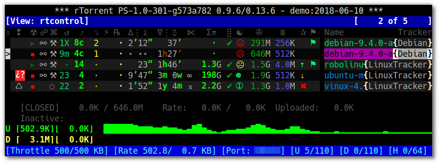
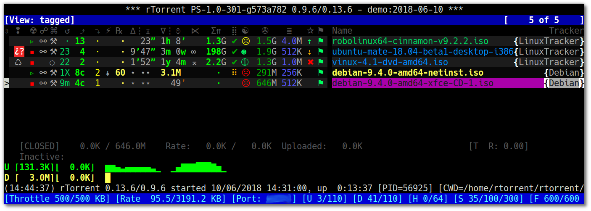

User's Manual
=============

This chapter describes the additional features in *rTorrent-PS*,
and other differences to a vanilla *rTorrent* build.

.. _features-std-cfg:

Additional Features
-------------------

Using the right default configuration (more on that below),
you will get the following additional features in your `rTorrent-PS` installation:

#.  the ``t`` key is bound to a ``trackers`` view that shows all items
    sorted by tracker and then by name.
    See `Additional Views`_ for details.
#.  the ``!`` key is bound to a ``messages`` view, listing all items
    that currently have a non-empty message, sorted in order of the
    message text.
    See `Additional Views`_ for details.
#.  the ``^`` key is bound to the ``rtcontrol`` search result view, so
    you can easily return to your last search.
    See `Additional Views`_ for details.
#.  the ``?`` key is bound to the ``indemand`` view, which sorts all
    open items by their activity, with the most recently active on top.
    See `Additional Views`_ for details.
#.  ``Page ↑`` and ``Page ↓`` scroll by 50 items at a time (or whatever
    other value ``ui.focus.page_size`` has).
#.  ``Home`` / ``End`` jump to the first / last item in the current
    view.
#.  the ``~`` key rotates through all available color themes, or a
    user-selected subset. See `Color Themes`_ for details.
#.  the ``<`` and ``>`` keys rotate through all added category views
    (``pyro.category.add=‹name›``), with filtering based on the
    ruTorrent label (``custom_1=‹name›``). See `Category Views`_ for details.
#.  ``|`` reapplies the category filter and thus updates the current
    category view.
#.  the ``u`` key shows the uptime and some other essential data of your
    rTorrent instance.
#.  ``F2`` shows some important help resources (web links) in the
    console log.
#.  ``*`` toggles between the collapsed (as described on `Extended
    Canvas Explained`_) and the expanded display of the current view.
    |rt-ps-canvas-v2-small|
#.  The ``active`` view is changed to include all incomplete items
    regardless of whether they have any traffic, and then groups the
    list into complete, incomplete, and queued items, in that order.
    Within each group, they're sorted by download and then upload speed.
#.  Some `canvas v2` columns are added in the `pimp-my-box` configuration –
    the selected throttle (⋉), a download's chunk size (≣),
    and the expected time of arrival (⌛⚪≋⚫) on the *active* and *leeching* displays only.
    The visibility of the chunk size column can be toggled using the ``_`` key.
#.  The commands ``s=«keyword»``, ``t=«tracker_alias»``, and
    ``f=«filter_condition»`` are pre-defined for searching using a
    Ctrl-X prompt.
#.  The ``.`` key toggles the membership in the ``tagged`` view for the
    item in focus, ``:`` shows the ``tagged`` view, and ``T`` clears
    that view (i.e. removes the tagged state on all items). This can be
    very useful to manually select a few items and then run
    ``rtcontrol`` on them, or alternatively use ``--to-view tagged`` to
    populate the ``tagged`` view, then deselect some items interactively
    with the ``.`` key, and finally mass-control the rest.
    See `Additional Views`_ for details.
#.  You can use the ``purge=`` and ``cull=`` commands (on a Ctrl-X
    prompt) for deleting the current item and its (incomplete) data.
#.  ``Ctrl-g`` shows the tags of an item (as managed by ``rtcontrol``);
    ``tag.add=‹tag›`` and ``tag.rm=‹tag›`` can be used to change the set
    of tags, both also show the new set of tags after changing them.
#.  Time-stamped log files with rotation, archival (compression), and pruning
    – with a setting for the number of days to keep logs in uncompressed form, or at all.
#.  Trackers are scraped regularly (active items relatively often,
    inactive items including closed ones seldomly), so that the display
    of downloads / seeders / leechers is not totally outdated.
    The ``&`` key can be used to manually scrape the item in focus.
#.  A watchdog for the ``pyrotorque`` daemon process (checks every 5 minutes,
    and starts it when missing *if* the `~/.pyroscope/run/pyrotorque` file exists).

With regards to using the ‘right’ configuration to get the above, you need
the ``*.rc.default`` files in the ``~/.pyroscope/rtorrent.d`` directory
provided by `pyrocore`.
`Standard Configuration Explained`_ has details on these.
Some more features are defined by the `pimp-my-box`_ configuration templates.

To get there, perform the :ref:`DebianInstallFromSource` as described in this manual,
or use the `pimp-my-box`_ project for an automatic remote installation.
The instructions in the `Extending your ‘.rtorrent.rc’`_ section of the `pyrocore` manual
only cover half of it, and you might miss some described features.

.. _Extending your ‘.rtorrent.rc’: https://pyrocore.readthedocs.org/en/latest/setup.html#extending-your-rtorrent-rc
.. _`Standard Configuration Explained`: https://pyrocore.readthedocs.io/en/latest/usage.html#std-config
.. _`Category Views`: https://pyrocore.readthedocs.io/en/latest/usage.html#category-views
.. _`Color Themes`: https://pyrocore.readthedocs.io/en/latest/usage.html#color-themes
.. _`Additional Views`: https://pyrocore.readthedocs.io/en/latest/usage.html#additional-views

.. _extended-canvas:

Extended Canvas Explained
-------------------------

The following is an explanation of the collapsed display of `rTorrent-PS` (*canvas v2*).

   Extended Canvas Screenshot

In case your screen looks broken compared to this,
see :ref:`terminal-setup` for necessary pre-conditions and settings
regarding your terminal emulator application and operating system.

In older builds, you need to remember to press the ``*`` key while showing a view,
or change the state of new views after adding them (by calling the `view.collapsed.toggle`_ command),
else you won't ever see it.

The following is an overview of the default columns, and what the values and icons in them mean.
A **⍰** after the column title indicates a ‘sacrificial’ column, which disappear when the display
gets too narrow to display all the columns. When even that does not provide enough space,
columns are omitted beginning on the right side (*Name* is always included).

❢
    Message or alert indicator (♺ = Tracker cycle complete,
    i.e. "Tried all trackers"; ⚡ = establishing connection;
    ↯ = data transfer problem; ◔ = timeout; ¿? = unknown torrent /
    info hash; ⨂ = authorization problem (possibly temporary); ⚠ = other)
☢
    Item state (▹ = started, ╍ = paused, ▪ = stopped)
☍    **⍰**
    Tied item? [⚯]
⌘    **⍰**
    Command lock-out? (⚒ = heed commands, ◌ = ignore commands)
↺   **⍰**
    Number of completions from last scrape info
⤴     **⍰**
    Number of seeds from last scrape info
⤵     **⍰**
    Number of leeches from last scrape info
⚡    **⍰**
    Transfer direction indicator [⇅ ↡ ↟]
℞
    Number of connected peers
∆⋮⌛
    Upload rate, or when inactive, time the download took (only after completion).
∇⋮⌚
    Approximate time since completion (units are «”’hdwmy» from seconds to years);
    for incomplete items the download rate or, if there's no traffic,
    the time since the item was started or loaded
⌛⚪≋⚫ **⍰**
    Expected time of arrival – only shown on the *active* and *leeching* displays
⋉   **⍰**
    Throttle selected for this item (∞ is the special ``NULL`` throttle; ⓪…⑨ for
    `ruTorrent`'s ``thr_0…9`` channels)
Σ⇈  **⍰**
    Total sum of uploaded data
⣿
    Completion status (✔ = done; else up to 8 dots [⣿] and ❚, i.e. progress in 10% steps);
    the old ``ui.style.progress.set`` command is deprecated,
    see :ref:`add-custom-columns` for the new way to get
    a different set of glyphs or an ASCII version
☯
    Ratio (☹ plus color indication for < 1, ➀ — ➉ : >= the number, ⊛ : >= 11);
    the old ``ui.style.ratio.set`` command is deprecated,
    see :ref:`add-custom-columns` for the new way to get
    a different set of number glyphs or an ASCII version
✇
    Data size
≣   **⍰**
    Chunk size - this column can be toggled on / off using the ``_`` key
✰
    Priority (✖ = off, ⇣ = low, nothing for normal, ⇡ = high)
⚑
    A ⚑ indicates this item is on the ``tagged`` view
Name
    Name of the download item – either the name contained in the metafile,
    or else the value of the ``displayname`` custom field when set on an item
Tracker
    Domain of the first HTTP tracker with seeds or leeches,
    or else the first one altogether – note that your can define nicer
    aliases using the `trackers.alias.set_key`_ command in your configuration

For the various time displays to work, you need
the `pyrocore` `standard configuration for rtorrent.rc`_.

The scrape info and peer numbers are exact only for values below 100, else they
indicate the order of magnitude using roman numerals (c = 10², m = 10³,
X = 10⁴, C = 10⁵, M = 10⁶).
For up-to-date scrape info, you need the `Tracker Auto-Scraping`_ configuration from `pyrocore`.

.. _`standard configuration for rtorrent.rc`: https://pyrocore.readthedocs.io/en/latest/setup.html#extending-your-rtorrent-rc
.. _`Tracker Auto-Scraping`: https://github.com/pyroscope/pyrocore/blob/master/src/pyrocore/data/config/rtorrent.d/auto-scrape.rc#L1

.. _commands:

Command Extensions
------------------

The following new commands are available.
Note that the links point to the `Commands Reference`_ chapter in the *rTorrent Handbook*.

.. include:: include-commands.rst

.. _`Commands Reference`: https://rtorrent-docs.readthedocs.io/en/latest/cmd-ref.html

.. _Bintray: https://bintray.com/pkg/show/general/pyroscope/rtorrent-ps/rtorrent-ps
.. _installation options: https://github.com/pyroscope/rtorrent-ps#installation
.. _Arch Linux: http://www.archlinux.org/
.. _`rtxmlrpc`: https://pyrocore.readthedocs.io/en/latest/usage.html#rtxmlrpc
.. _`pimp-my-box`: https://github.com/pyroscope/pimp-my-box/

.. end of "manual.rst"
