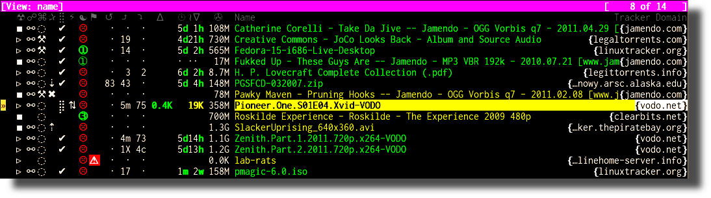
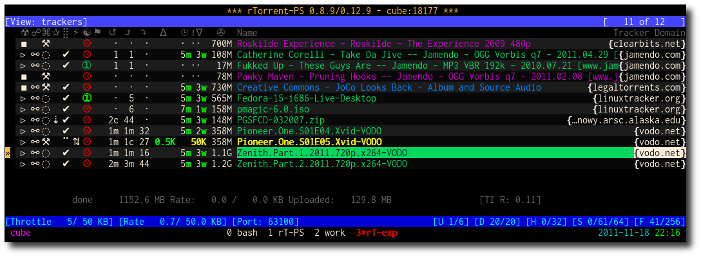
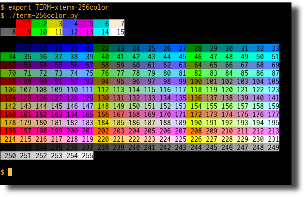

User's Manual
=============

This chapter describes the additional features in *rTorrent-PS*,
and other differences to a vanilla *rTorrent* build.

.. _features-std-cfg:

Additional Features
-------------------

If you followed the instructions in the `Extending your ‘.rtorrent.rc’`_
section of the ``pyrocore`` manual, you will get the following
`additional features`_ in your ``rTorrent-PS`` installation:

#.  the ``t`` key is bound to a ``trackers`` view that shows all items
    sorted by tracker and then by name.
    See `Additional Views`_ for details.
#.  the ``!`` key is bound to a ``messages`` view, listing all items
    that currently have a non-empty message, sorted in order of the
    message text.
    See `Additional Views`_ for details.
#.  the ``^`` key is bound to the ``rtcontrol`` search result view, so
    you can easily return to your last search.
    See `Additional Views`_ for details.
#.  the ``?`` key is bound to the ``indemand`` view, which sorts all
    open items by their activity, with the most recently active on top.
    See `Additional Views`_ for details.
#.  ``Page ↑`` and ``Page ↓`` scroll by 50 items at a time (or whatever
    other value ``ui.focus.page_size`` has).
#.  ``Home`` / ``End`` jump to the first / last item in the current
    view.
#.  the ``~`` key rotates through all available color themes, or a
    user-selected subset. See `Color Themes`_ for details.
#.  the ``<`` and ``>`` keys rotate through all added category views
    (``pyro.category.add=‹name›``), with filtering based on the
    ruTorrent label (``custom_1=‹name›``). See `Category Views`_ for details.
#.  ``|`` reapplies the category filter and thus updates the current
    category view.
#.  the ``u`` key shows the uptime and some other essential data of your
    rTorrent instance.
#.  ``F2`` shows some important help resources (web links) in the
    console log.
#.  ``*`` toggles between the collapsed (as described on `Extended
    Canvas Explained`_) and the expanded display of the current view.
    |rt-ps-name-view|
#.  The ``active`` view is changed to include all incomplete items
    regardless of whether they have any traffic, and then groups the
    list into complete, incomplete, and queued items, in that order.
    Within each group, they're sorted by download and then upload speed.
#.  The commands ``s=«keyword»``, ``t=«tracker_alias»``, and
    ``f=«filter_condition»`` are pre-defined for searching using a
    Ctrl-X prompt.
#.  The ``.`` key toggles the membership in the ``tagged`` view for the
    item in focus, ``:`` shows the ``tagged`` view, and ``T`` clears
    that view (i.e. removes the tagged state on all items). This can be
    very useful to manually select a few items and then run
    ``rtcontrol`` on them, or alternatively use ``--to-view tagged`` to
    populate the ``tagged`` view, then deselect some items interactively
    with the ``.`` key, and finally mass-control the rest.
    See `Additional Views`_ for details.
#.  You can use the ``purge=`` and ``cull=`` commands (on a Ctrl-X
    prompt) for deleting the current item and its (incomplete) data.
#.  ``Ctrl-g`` shows the tags of an item (as managed by ``rtcontrol``);
    ``tag.add=‹tag›`` and ``tag.rm=‹tag›`` can be used to change the set
    of tags, both also show the new set of tags after changing them.
#.  Trackers are scraped regularly (active items relatively often,
    inactive items including closed ones seldomly), so that the display
    of downloads / seeders / leechers is not totally outdated.

.. _Extending your ‘.rtorrent.rc’: https://pyrocore.readthedocs.org/en/latest/setup.html#extending-your-rtorrent-rc
.. _`additional features`: https://pyrocore.readthedocs.io/en/latest/usage.html#std-config
.. _`Category Views`: https://pyrocore.readthedocs.io/en/latest/usage.html#category-views
.. _`Color Themes`: https://pyrocore.readthedocs.io/en/latest/usage.html#color-themes
.. _`Additional Views`: https://pyrocore.readthedocs.io/en/latest/usage.html#additional-views

.. _extended-canvas:

Extended Canvas Explained
-------------------------

Columns in the Collapsed Display
^^^^^^^^^^^^^^^^^^^^^^^^^^^^^^^^

The following is an explanation of the collapsed display of
*rTorrent-PS* — remember that you need to bind a key to the
``view.collapsed.toggle`` command, or set the default of a view by
`calling that command in the configuration`_, else you won't ever see it.

   rTorrent-PS Trackers View

The following is an overview of the column heading icons, and what the values and icons in it mean.

☢
    Item state (▹ = started, ╍ = paused, ▪ = stopped)
☍
    Tied item? [⚯]
⌘
    Command lock-out? (⚒ = heed commands, ◌ = ignore commands)
✰
    Priority (✖ = off, ⇣ = low, nothing for normal, ⇡ = high)
⣿
    Completion status (✔ = done; else up to 8 dots [⣿], i.e. 9 levels of 11% each);
    change to bar style using ``ui.style.progress.set=2``, ``0`` is a *mostly* ASCII one
⚡
    Transfer direction indicator [⇅ ↡ ↟]
☯
    Ratio (☹ plus color indication for < 1, ➀ — ➉ : >= the number, ⊛ : >= 11);
    change to a different set of number glyphs using ``ui.style.ratio.set=2`` (or ``3``),
    ``0`` is a *mostly* ASCII one
⚑
    Message (♺ = Tracker cycle complete, i.e. "Tried all trackers"; ⚡ = establishing connection;
    ↯ = data transfer problem; ◔ = timeout; ¿? = unknown torrent / info hash;
    ⨂ = authorization problem (possibly temporary); ⚠ = other; ⚑ = on the ``tagged`` view)
↺
    Number of completions from last scrape info
⤴
    Number of seeds from last scrape info
⤵
    Number of leeches from last scrape info
∆
    Upload rate
⌚ ≀∇
    Approximate time since completion (units are «”’hdwmy» from seconds to years);
    for incomplete items the download rate or, if there's no traffic,
    the time since the item was loaded
✇
    Data size
Name
    Name of the download item
Tracker Domain
    Domain of the first HTTP tracker with seeds or leeches,
    or else the first one altogether

The scrape info numbers are exact only for values below 100, else they
indicate the order of magnitude using roman numerals (c = 10², m = 10³,
X = 10⁴, C = 10⁵, M = 10⁶).

For the completion time display to work, you need the following in your
``.rtorrent.rc``, which you already do if you installed the
`PyroScope CLI Tools`_ correctly (i.e. using the standard ``.rtorrent.rc`` include):

.. code-block:: ini

    system.method.set_key = event.download.finished,time_stamp, \
        "d.set_custom=tm_completed,$cat=$system.time= ;d.save_session="

Customizing the Display Layout
^^^^^^^^^^^^^^^^^^^^^^^^^^^^^^

.. rubric:: Canvas v2 Overview

The main display with the downloads list is flexible and
can be configured to your will, in `rTorrent-PS 1.1` and up.
This is also known as *canvas v2*.

Use the following `rtxmlrpc`_ command to check if you have a version
that can do this:

.. code-block:: console

    # The '1' means you have canvas v2 on board;
    # a '0' or "Method 'system.has' not defined" means you don't.
    $ rtxmlrpc system.has=,canvas_v2
    1

The only fixed parts are the position indicator at the very left of the display,
and the combined name / tracker column on the right.
The latter takes all the space left by other columns.

.. rubric:: Inspecting Your Display Configuration

To list the columns you have in your setup, call  `rtxmlrpc`_ like so:

.. code-block:: console

    $ rtxmlrpc method.get=,ui.column.render | sed -re 's/ /␣/g' | sort
    100:3C95/2:❢␣␣
    110:2C92/2:☢␣
    120:?2:☍␣
    130:?2:⌘␣
    400:?3C23/3:␣↺␣
    410:?3C24/3:␣⤴␣
    420:?3C14/3:␣⤵␣
    500:?2:⚡␣
    510:3C28/3:℞␣␣
    520:6C96/6:∆⋮␣⌛␣␣
    530:6C90/6:∇⋮␣⌚␣␣
    800:3:⋉␣
    900:?5C24/3C21/2:␣Σ⇈␣␣
    910:2C94/2:⣿␣
    920:3C93/3:☯␣␣
    930:5C15/3C21/2:␣✇␣␣␣
    970:2C91/2:✰␣
    980:2C16/2:⚑␣

The important thing here are the numbers in front,
which define the sort order of columns from left to right.
They also allow to address a specific column,
which becomes important in a moment.

All these are built-in defaults, except the throttle indicator ``⋉`` with index 800,
which is defined in `~/rtorrent/rtorrent.d/05-rt-ps-columns.rc`_ of `pimp-my-box`_.

.. important::

    You **MUST** update your `pimp-my-box`_ configuration
    if you used that to set up your system.
    Otherwise you'll get duplicate columns.

To show the full column definitions with their code, call `pyroadmin`_:

.. code-block:: console

    $ pyroadmin --dump-rc | grep -A1 ui.column.render | egrep '^(method.set_key|    )'
    method.set_key = ui.column.render, "100:3C95/2:❢  ", \
        ((array.at, {"  ", "♺ ", "⚠ ", "◔ ", "⚡ ", "↯ ", "¿?", "⨂ "}, ((d.message.alert)) ))
    method.set_key = ui.column.render, "110:2C92/2:☢ ", \
        ((string.map, ((cat, ((d.is_open)), ((d.is_active)) )), {00, "▪ "}, …, {11, "▹ "}))
    …
    method.set_key = ui.column.render, "980:2C16/2:⚑ ", \
        ((array.at, {"  ", "⚑ "}, ((d.views.has, tagged)) ))

.. rubric:: Disabling Columns

**TODO** Describe ``ui.column.disabled`` when it's done.

.. rubric:: Column Layout Definitions

**TODO** WTF is ``?3C93/3``, and other questions.

.. rubric:: Defining Your Own Columns

.. image:: https://raw.githubusercontent.com/pyroscope/rtorrent-ps/master/docs/_static/img/rt-ps-canvas_v2-ascii-ratio.png
    :align: right
    :alt: Canvas v2 ASCII Ratio

This example shows how to replace the ratio column (920)
with a pure ASCII version. You can see the result on the right.

Place this code in your custom configuration,
e.g. in the ``_rtlocal.rc`` file (when using `pimp-my-box`_).

.. code-block:: ini

    # Remove default column
    method.set_key = ui.column.render, "920:3C93/3:☯  "

    # Add ASCII ratio in percent
    # (1..99 for incomplete; 1c = 1.0; 1m = 10.0; …)
    method.set_key = ui.column.render, "920:3C93/3:R% ", \
        ((string.replace, ((convert.magnitude, ((math.div, ((d.ratio)), 10)) )), \
                          {"⋅", "."} ))

To construct a column definition like this,
you need to understand `rTorrent Scripting`_ first
– more so than what's sufficient for writing simple configurations.

Looking at the original column definition often helps, e.g. to grab a few snippets for your own version:

.. code-block:: ini

    $ pyroadmin --dump-rc | grep -A1 920:3 | egrep '^(method.set_key|    )'
    method.set_key = ui.column.render, "920:3C93/3:☯  ", \
        ((string.substr, "☹ ➀ ➁ ➂ ➃ ➄ ➅ ➆ ➇ ➈ ➉ ", \
                         ((math.mul, 2, ((math.div, ((d.ratio)), 1000)) )), 2, "⊛ "))

Also, try to understand how all the other column definitions work,
you can learn a few tricks that are typical for column rendering.

Especially if you want to display additional values in the same format as an existing column,
you just have to swap the command accessing the displayed item's data.
Here's a chunk size column, all you need to do is replace ``d.size_bytes`` with ``d.chunk_size``,
and giving it a new index and heading.

.. code-block:: ini

    ui.color.custom9.set = "bright blue"
    method.set_key = ui.column.render, "935:5C9/3C21/2: ≣   ", \
        ((convert.human_size, ((d.chunk_size)) ))

That example also shows how to use a custom color.

Adding Traffic Graphs
^^^^^^^^^^^^^^^^^^^^^

Add these lines to your configuration:

.. code-block:: ini

    # Show traffic of the last hour
    network.history.depth.set = 112
    schedule = network_history_sampling,1,32, network.history.sample=
    method.insert = network.history.auto_scale.toggle, simple|private, \
        "branch=network.history.auto_scale=, \
            \"network.history.auto_scale.set=0\", \
            \"network.history.auto_scale.set=1\""
    method.insert = network.history.auto_scale.ui_toggle, simple|private, \
        "network.history.auto_scale.toggle= ;network.history.refresh="
    branch=pyro.extended=,"schedule = bind_auto_scale,0,0, \
        \"ui.bind_key=download_list,=,network.history.auto_scale.ui_toggle=\""

And you'll get this in your terminal:

.. figure:: _static/img/rt-ps-network-history.png
   :align: center
   :alt: rTorrent-PS Network History

   rTorrent-PS Network History

As you can see, you get the upper and lower bounds of traffic within
your configured time window, and each bar of the graph represents an
interval determined by the sampling schedule. Pressing ``=`` toggles
between a graph display with base line 0, and a zoomed view that scales
it to the current bounds.

Setting Up Your Terminal
^^^^^^^^^^^^^^^^^^^^^^^^

The font used in the above example is ``Inconsolata``, and whatever font
you use in your terminal profile, it of course has to support the
characters used in the status columns. Also, your terminal **must** be
set to use UTF-8 (which nowadays usually is the default anyway), that
means ``LANG`` should be something like ``en_US.UTF-8``, and ``LC_ALL``
and ``LC_CTYPE`` should **not** bet set at all! If you use a terminal
multiplexer like most people do, and the display doesn't look right, try
``tmux -u`` respectively ``screen -U`` to force UTF-8 mode. Also make
sure you have the ``locales`` package installed on Debian-type systems.

On Windows using PuTTY (version 0.60), change the settings for font and
character set as follows:

-  ``DejaVu Sans Mono`` in ``Window / Appearance``
-  ``UTF-8`` in ``Window / Translation``

Also see this `superuser Q&A`_ for additional tips, you especially
should try to use ``Everson Mono`` as a fallback font `as described
here`_.

Other fonts that were suggested are ``Andale Mono``, and
``GNU Unifont``. You have to try out yourself what looks good to you and
works with your specific system and terminal emulator.

The following command lets you easily check whether your font supports
all the necessary characters and your terminal is configured correctly:

.. code-block:: shell

    python -c 'print u"\u22c5 \u22c5\u22c5 \u201d \u2019 \u266f \u2622 \u260d \u2318 \u2730 " \
        u"\u28ff \u26a1 \u262f \u2691 \u21ba \u2934 \u2935 \u2206 \u231a \u2240\u2207 \u2707 " \
        u"\u26a0\xa0\u25d4 \u26a1\xa0\u21af \xbf \u2a02 \u2716 \u21e3 \u21e1  \u2801 \u2809 " \
        u"\u280b \u281b \u281f \u283f \u287f \u28ff \u2639 \u2780 \u2781 \u2782 \u2783 \u2784 " \
        u"\u2785 \u2786 \u2787 \u2788 \u2789 \u25b9\xa0\u254d \u25aa \u26af \u2692 \u25cc " \
        u"\u21c5 \u21a1 \u219f \u229b \u267a ".encode("utf8")'

Supporting 256 or more colors
^^^^^^^^^^^^^^^^^^^^^^^^^^^^^

To enable 256 colors, your terminal must obviously be able to support
them at all (i.e. have a ``xterm-256color`` terminfo entry, or similar).
But even if that is the case, you often need to give a little nudge to
the terminal multiplexers; namely start ``tmux`` with the ``-2`` switch
(that forces 256 color mode), or for ``screen`` start it with the
terminal already set to 256 color mode so it can sense the underlying
terminal supports them, i.e. use this in your startup script:

.. code-block:: shell

    if [ "$TERM" = "${TERM%-256color}" ]; then
        export TERM="$TERM-256color"
    fi
    tmux ...

Then, within the terminal multiplexer's environment, you must **again**
ensure the ``TERM`` variable is set to a 256 color terminfo entry, i.e.
repeat the above ``if`` construct in your ``rtorrent`` start script. The
reward for jumping through all those hoops is that you can then use
color gradients for ratio coloring, and much more appropriate pallid
color shades for backgrounds.

The following color settings work better than the default ones in a 256
color terminal (gnome-terminal), for me at least. Your mileage (color
table) may vary. Having 256 colors means you have very dark shades of
grey, and that is used here to set the even / odd backgrounds.

.. code-block:: ini

    ui.color.complete.set=41
    ui.color.stopped.set=33

    ui.color.footer.set="bright cyan on 20"
    ui.color.even.set="on 234"
    ui.color.odd.set="on 232"

    ui.color.progress0.set=196
    ui.color.progress20.set=202
    ui.color.progress40.set=213
    ui.color.progress60.set=214
    ui.color.progress80.set=226
    ui.color.progress100.set=41
    ui.color.progress120.set="bold bright green"

|rt-ps-glyphs|

.. _calling that command in the configuration: https://github.com/pyroscope/pyrocore/blob/master/src/pyrocore/data/config/rtorrent.d/collapse-built-in-views.rc
.. _PyroScope CLI Tools: https://pyrocore.readthedocs.org/
.. _superuser Q&A: http://superuser.com/questions/393834/how-to-configure-putty-to-display-these-characters
.. _as described here: http://superuser.com/a/764855

.. |rt-ps-glyphs| image:: https://raw.githubusercontent.com/pyroscope/rtorrent-ps/master/docs/_static/img/rt-ps-glyphs.png

.. _commands:

Command Extensions
------------------

The following new commands are available.

.. contents:: List of Commands
   :local:

compare=order,command1=[,...]
^^^^^^^^^^^^^^^^^^^^^^^^^^^^^

Compares two items like ``less=`` or ``greater=``, but allows to compare
by several different sort criteria, and ascending or descending order
per given field.

The first parameter is a string of order indicators, either ``aA+`` for
ascending or ``dD-`` for descending. The default, i.e. when there's more
fields than indicators, is ascending. Field types other than value or
string are treated as equal (or in other words, they're ignored). If all
fields are equal, then items are ordered in a random, but stable
fashion.

Configuration example:

.. code-block:: ini

    # VIEW: Show active and incomplete torrents (in view #9) and update every 20 seconds
    # Items are grouped into complete, incomplete, and queued, in that order.
    # Within each group, they're sorted by upload and then download speed.
    view_sort_current = active,"compare=----,d.is_open=,d.get_complete=,d.get_up_rate=,d.get_down_rate="
    schedule = filter_active, 12, 20, \
        "view_filter = active,\"or={d.get_up_rate=,d.get_down_rate=,not=$d.get_complete=}\" ; \
         view_sort=active"

ui.bind\_key=display,key,"command1=[,...]"
^^^^^^^^^^^^^^^^^^^^^^^^^^^^^^^^^^^^^^^^^^

Binds the given key on a specified display to execute the commands when
pressed.

-  ``display`` must be equal to ``download_list`` (currently, no other
   displays are supported).
-  ``key`` can be either a single character for normal keys, ``^`` plus
   a character for control keys, or a 4 digit octal key code.

.. important::

    This currently can NOT be used immediately when ``rtorrent.rc`` is parsed,
    so it has to be scheduled once shortly after startup (see below example).

Configuration example:

.. code-block:: ini

    # VIEW: Bind view #7 to the "rtcontrol" result
    schedule = bind_7,0,0,"ui.bind_key=download_list,7,ui.current_view.set=rtcontrol"

view.collapsed.toggle=«VIEW NAME»
^^^^^^^^^^^^^^^^^^^^^^^^^^^^^^^^^

This command changes between the normal item display where each item
takes up three lines to a more condensed form where each item only takes
up one line. Note that each view has its own state, and that if the view
name is empty, the current view is toggled. You can set the default
state in your configuration, by adding a toggle command for each view
you want collapsed after startup (the default is expanded).

Also, you should bind the current view toggle to a key, like this:

.. code-block:: ini

    schedule = bind_collapse,0,0,"ui.bind_key=download_list,*,view.collapsed.toggle="

Further explanations on what the columns show and what forms of
abbreviations are used, to get a display as compact as possible while
still showing all the important stuff, can be found on :ref:`extended-canvas`.
That section also contains hints on **how to correctly setup your terminal**.

ui.color.«TYPE».set="«COLOR DEF»"
^^^^^^^^^^^^^^^^^^^^^^^^^^^^^^^^^

These commands allow you to set colors for selected elements of the user
interface, in some cases depending on their status. You can either
provide colors by specifying the numerical index in the terminal's color
table, or by name (for the first 16 colors).

The possible color names
are "black", "red", "green", "yellow", "blue", "magenta", "cyan",
"gray", and "white"; you can use them for both text and background
color, in the form "«fg» on «bg»", and you can add "bright" in front of
a color to select a more luminous version. If you don't specify a color,
the default of your terminal is used.

Also, these additional modifiers can be placed in the color definitions,
but it depends on the terminal you're using whether they have an effect:
"bold", "standout", "underline", "reverse", "blink", and "dim".

Here's a configuration example showing all the commands and their
defaults:

.. code-block:: ini

    # UI/VIEW: Colors
    ui.color.alarm.set="bold white on red"
    ui.color.complete.set="bright green"
    ui.color.even.set=""
    ui.color.focus.set="reverse"
    ui.color.footer.set="bold bright cyan on blue"
    ui.color.incomplete.set="yellow"
    ui.color.info.set="white"
    ui.color.label.set="gray"
    ui.color.leeching.set="bold bright yellow"
    ui.color.odd.set=""
    ui.color.progress0.set="red"
    ui.color.progress20.set="bold bright red"
    ui.color.progress40.set="bold bright magenta"
    ui.color.progress60.set="yellow"
    ui.color.progress80.set="bold bright yellow"
    ui.color.progress100.set="green"
    ui.color.progress120.set="bold bright green"
    ui.color.queued.set="magenta"
    ui.color.seeding.set="bold bright green"
    ui.color.stopped.set="blue"
    ui.color.title.set="bold bright white on blue"

Note that you might need to enable support for 256 colors in your
terminal, see this article for a description. In a nutshell, you need to
install the ``ncurses-term`` package if you don't have it already, and
also add these commands to your rTorrent start script:

.. code-block:: shell

    if [ "$TERM" = "${TERM%-256color}" ]; then
        export TERM="$TERM-256color"
    fi

Also consider the hints at the end of the `Extended Canvas Explained`_
page.

If everything worked so far, and you now want to find you own coloring
theme, the easiest way is to use a second shell and ``rtxmlrpc``. Try
out some colors, and add the combinations you like to your
``~/.rtorrent.rc``.

.. code-block:: shell

    # For people liking candy stores...
    rtxmlrpc ui.color.title.set "bold magenta on bright cyan"

You can use the following code in a terminal to dump a color scheme:

.. code-block:: shell

    for i in $(rtxmlrpc system.listMethods | grep ui.color. | grep -v '\.set$'); do
        echo $i = $(rtxmlrpc -r $i | tr "'" '"') ;
    done

The term-256color script can help you with showing the colors your
terminal supports, an example output using Gnome's terminal looks like
the following...

   xterm-256-color

ui.current\_view= (merged into 0.9.7+)
^^^^^^^^^^^^^^^^^^^^^^^^^^^^^^^^^^^^^^

Returns the currently selected view, the vanilla 0.9.6 release only has
a setter.

Needed if you want to use a hyphen ``-`` as a view name in ``rtcontrol``
to refer to the currently shown view. An example for that is passing
``-M-`` as an option, which performs in-place filtering of the current
view via ``rtcontrol``.

Another use-case for this command is if you want to rotate through a set
of views via XMLRPC.

log.messages=«path»
^^^^^^^^^^^^^^^^^^^

(Re-)opens a log file that contains the messages normally only visible
on the main panel and via the ``l`` key. Each line is prefixed with the
current date and time in ISO8601 format. If an empty path is passed, the
file is closed.

network.history.\*=
^^^^^^^^^^^^^^^^^^^

Commands to add network traffic charts to the bottom of the collapsed
download display. The commands added are
``network.history.depth[.set]=``, ``network.history.sample=``,
``network.history.refresh=``, and ``network.history.auto_scale=``.
See the :ref:`extended-canvas` on how to use them.

d.tracker\_domain=
^^^^^^^^^^^^^^^^^^

Returns the (shortened) tracker domain of the given download item. The
chosen tracker is the first HTTP one with active peers (seeders or
leechers), or else the first one.

trackers.alias.set\_key=«domain»,«alias»
^^^^^^^^^^^^^^^^^^^^^^^^^^^^^^^^^^^^^^^^

Sets an alias that replaces the given domain, when displayed on the
right of the collapsed canvas.

Configuration example:

.. code-block:: ini

    trackers.alias.set_key = bttracker.debian.org, Debian

trackers.alias.items=
^^^^^^^^^^^^^^^^^^^^^

Returns all the mappings in the form ``«domain»=«alias»`` as a list.

Note that domains that were not explicitly defined so far, but shown
previously, are also contained in the list, with an empty alias. So to
create a list for you to fill in the aliases, scroll through all your
items on ``main`` or ``trackers``, so you can dump the domains of all
loaded items.

Example that prints all the domains and their aliases as commands that
define them:

.. code-block:: shell

    rtxmlrpc trackers.alias.items \
        | sed -r -e 's/=/, "/' -e 's/^/trackers.alias.set_key = /' -e 's/$/"/' \
        | tee ~/rtorrent/rtorrent.d/tracker-aliases.rc

This also dumps them into the ``tracker-aliases.rc`` file to persist
your mappings, and also make them easily editable. To reload edited
alias definitions, use this:

.. code-block:: shell

    rtxmlrpc "try_import=,~/rtorrent/rtorrent.d/tracker-aliases.rc"

system.env=«name» (merged into 0.9.7+)
^^^^^^^^^^^^^^^^^^^^^^^^^^^^^^^^^^^^^^

Returns the value of the given environment variable, or an empty string
if it does not exist.

Configuration example:

.. code-block:: ini

    session.path.set="$cat=\"$system.env=RTORRENT_HOME\",\"/.session\""

system.random=[[«lower»,]«upper»]
^^^^^^^^^^^^^^^^^^^^^^^^^^^^^^^^^

Generate *uniformly* distributed random numbers in the range defined by
``lower``..``upper``.

The default range with no args is ``0`` … ``RAND_MAX``. Providing just
one argument sets an *exclusive* upper bound, and two arguments define
an *inclusive* range.

An example use-case is adding jitter to time values that you later check
with ``elapsed.greater``, to avoid load spikes and similar effects of
clustered time triggers.

value=«number»[,«base»]
^^^^^^^^^^^^^^^^^^^^^^^

Converts a given number with the given base (or 10 as the default) to an
integer value.

Examples:

.. code-block:: console

    $ rtxmlrpc --repr value '' 1b 16
    27
    $ rtxmlrpc --repr value '' 1b
    ERROR    While calling value('', '1b'): <Fault -503: 'Junk at end of number: 1b'>

string.contains[\_i]=«haystack»,«needle»[,…]
^^^^^^^^^^^^^^^^^^^^^^^^^^^^^^^^^^^^^^^^^^^^

Checks if a given string contains any of the strings following it. The
variant with ``_i`` is case-ignoring, but *only* works for pure ASCII
needles.

Example:

.. code-block:: shell

    rtxmlrpc d.multicall.filtered '' '' 'string.contains_i=(d.name),x264.aac' d.hash= d.name=

d.multicall.filtered=«viewname»,«condition»,«command»[,…]
^^^^^^^^^^^^^^^^^^^^^^^^^^^^^^^^^^^^^^^^^^^^^^^^^^^^^^^^^

Iterates over all items of a view (or ``default`` if the view name is
empty), just like ``d.multicall2``, but only calls the given commands if
``condition`` is true for an item.

See directly above for an example.

.. _Bintray: https://bintray.com/pkg/show/general/pyroscope/rtorrent-ps/rtorrent-ps
.. _installation options: https://github.com/pyroscope/rtorrent-ps#installation
.. _Arch Linux: http://www.archlinux.org/
.. _`rtxmlrpc`: https://pyrocore.readthedocs.io/en/latest/usage.html#rtxmlrpc
.. _`pyroadmin`: https://pyrocore.readthedocs.io/en/latest/references.html#pyroadmin
.. _`pimp-my-box`: https://github.com/pyroscope/pimp-my-box/
.. _`~/rtorrent/rtorrent.d/05-rt-ps-columns.rc`: https://github.com/pyroscope/pimp-my-box/blob/master/roles/rtorrent-ps/templates/rtorrent/rtorrent.d/05-rt-ps-columns.rc#L1
.. _`rTorrent Scripting`: https://rtorrent-docs.readthedocs.io/en/latest/scripting.html#

.. end of "manual.rst"
